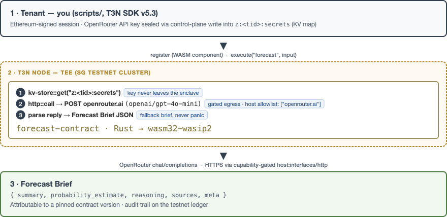

# T3N Forecast Brief Agent

A **forecasting agent on T3N** (Terminal 3 Network) whose LLM call runs **inside the TEE**. Give it a forecasting question, get back a structured **Forecast Brief** — summary, calibrated probability estimate, reasoning, sources — produced by a real LLM (OpenRouter) that executes *inside confidential compute*, with credentials stored in the TEE's key-value store and every outbound host gated by the platform's egress allowlist.

Registered on T3N testnet (SG cluster) as contract **`z:<tenant-tid>:forecast-contract` v0.1.1** — the live brief for *"Will the Federal Reserve cut rates before October 2026?"* estimated **0.45** with `probability_source: "llm-json"`.



## What it demonstrates

- **Real LLM inside the enclave** — not a mock: the WASM contract reads an API key from the TEE KV store, performs an outbound HTTPS call to OpenRouter via `host:interfaces/http@2.1.0`, parses the reply and returns a structured, typed brief. `meta.placeholder = false`, `meta.probability_source = "llm-json"`.
- **Capability-scoped contract** — the WIT world imports exactly `tenant-context`, `logging`, `kv-store`, `http`. Outbound traffic is denied unless the caller holds a delegation grant with `allowed_hosts: ["openrouter.ai"]` (set via `t3n.updateMemberDelegation`).
- **Secrets hygiene** — the OpenRouter key is sealed into `z:<tid>:secrets` with the map ACL scoped to the contract id (`writers/readers: only: [contract_id]`); the tenant scripts never print it and it never travels into the contract input.
- **Graceful degradation** — every failure path (egress denied, HTTP error, malformed JSON) yields an informative *fallback brief* with `meta.llm_error` set, never a panic.

## Repo layout

```
forecast-contract/   Rust → WASM component (the TEE contract)
  src/forecast.rs    forecasting logic: phase-2 LLM path + phase-1 native placeholder + parser + tests
  src/lib.rs         bindgen wiring + WIT Guest impl + CONTRACT_VERSION
  wit/world.wit      `world forecast-contract` — imports (capability set) + export `forecast`
scripts/
  lib.ts                  shared bootstrap: trust anchor (with CN-cluster fixes), auth, TenantClient
  create-kv-maps.ts       create + ACL `secrets` map, seal llm_api_key (control-plane write)
  register-contract.ts    register the WASM component, bump version, re-scope map ACL
  grant-egress-v2.ts      self-grant egress via updateMemberDelegation (the working path)
  invoke-contract.ts      execute `forecast` end-to-end and pretty-print the brief
```

## Setup (2 commands)

Prerequisites: Node 20+, `npx tsx` (bundled as a dependency), and a T3N account with an API key saved at `~/.t3n_api_key.txt` (see [docs.terminal3.io](https://docs.terminal3.io) — *set up dev env*). Optional for the real LLM: an OpenRouter key at `~/.openrouter_key` — a free-tier key is enough (`openai/gpt-4o-mini`).

```sh
npm install
npm run setup:kv && npm run register && npm run grant:egress && npm run invoke
```

That's the whole pipeline: create the secrets KV map → build/compile & register the contract → grant egress → invoke and receive the brief. (Building the WASM is only needed after editing the Rust contract — see below.)

> **Note** — `scripts/lib.ts` reads `~/.t3n_api_key.txt`. To target a different tenant, change `TENANT_DID` there and the canonical name in the two scripts that hardcode it (`grant-egress-v2.ts`, `invoke-contract.ts`, and the tail constant is shared).

## Running / verifying

```sh
npm run invoke
# → prints raw response + the parsed Forecast Brief:
# {
#   "summary": "Markets assign roughly a 45% likelihood…",
#   "probability_estimate": 0.45,
#   "reasoning": "Base rates… key uncertainties…",
#   "sources_placeholder": [],
#   "meta": {
#     "phase": "2-llm-in-tee", "placeholder": false,
#     "model": "openai/gpt-4o-mini", "probability_source": "llm-json"
#   }
# }
```

Switch models without recompiling (any OpenRouter model id):

```sh
OPENROUTER_MODEL=openrouter/free npm run invoke
```

### Contract tests (native)

The forecasting logic is host-independent Rust; `cargo test` runs it natively — no TEE, no node, no keys. Because the crate pins `wasm32-wasip2` globally (`~/.cargo/config.toml`), the host target must be installed once:

```sh
rustup target add x86_64-apple-darwin
cd forecast-contract && CARGO_BUILD_TARGET=x86_64-apple-darwin cargo test
```

Verified green: **9 unit tests + 1 doc-test** — brief shape, empty-question rejection, probability-parser suite (JSON numbers, `"55%"` strings, text scanning that ignores interest-rate percentages, normalization).

### Building the WASM component

Only needed after editing the Rust contract; `register-contract.ts` reads the artifact:

```sh
cd forecast-contract && cargo build --target wasm32-wasip2 --release
# → target/wasm32-wasip2/release/forecast_contract.wasm (~136 KB component)
```

Verify the component exports the T3N interface:

```sh
wasm-tools component wit target/wasm32-wasip2/release/forecast_contract.wasm
# export z:forecast-contract/contracts@0.1.0 (function: forecast)
```

## Design decisions & architecture notes

1. **Rust → wasm32-wasip2 *component***, `crate-type = ["cdylib", "lib"]`, wit-bindgen 0.49. `cdylib` emits the WASM component (T3N requirement); `lib` keeps the logic unit-testable natively. The LLM path is `#[cfg(target_arch = "wasm32")]` (it needs host imports), while parsing/normalization is pure and tested on the host.
2. **One export, no dispatch** — per T3N convention the WIT function name *is* the export (`forecast: func(req: generic-input) -> result<list<u8>, string>`; the 3-field `generic-input` envelope matches the reference `z-tenant-flight` contract). Errors are plain strings on the `err` branch — no `ContractError` enum to keep the shape ABI-stable.
3. **Capability set = WIT imports.** The world imports exactly what the contract uses; egress authorization lives *not in the world* but in the caller's delegation grant (`allowed_hosts`), so adding/removing hosts never requires recompiling the contract.
4. **Version bumps without ABI breaks** — re-registering bumps only `Cargo.toml`/`CONTRACT_VERSION` (patch), never the WIT world; the testnet rejected submissions with an interface version bump.
5. **KV maps deny-by-default** — `tenant.maps.create` without explicit `readers`/`writers` ACLs produces deny-all; `create-kv-maps.ts` scopes both to the registered `contract_id`, and `register-contract.ts` re-scopes after every registration (ids change on re-register).
6. **Model as data, not code** — the LLM model id is an input field (default compiled in), so model trials are an `npm run invoke` flag, not a rebuild.

## SDK ↔ cluster integration blockers (v5.3.0 ↔ SG testnet — workarounds shipped)

We hit three points of SDK ↔ cluster misalignment during the build. Epistemic status up front: the workarounds run green, but we **could not determine root cause from the outside** — the SDK ships obfuscated, so whether each item is SDK version lag, intentional CN-cluster config, or a design gap is **a question for the T3N team, not a claim by us**. Where a workaround touches security-sensitive validation, it is flagged as demo-only.

### Blocker 1 — `fetchTrustedManifest` rejects the SG-cluster manifest (missing `rtmr1_allowlist`)

- **Repro:** `curl https://cn-api.sg.testnet.t3n.terminal3.io/api/trust-manifest` returns well-formed JSON — *without any `rtmr1_allowlist` key*. `manifestToTrustAnchor()` accepts it as-is; the SDK's internal `fetchTrustedManifest` path throws `"malformed…"`.
- **Observation:** the SDK requires `rtmr1_allowlist` as mandatory; the cluster endpoint doesn't serve that key.
- **Workaround** (`scripts/lib.ts → buildTrustAnchor`): fetch manually, synthesize the field, then hand the corrected object to `manifestToTrustAnchor`.
- **For T3N review:** should the endpoint serve `rtmr1_allowlist`, or is the SDK's requirement ahead of this cluster state?

### Blocker 2 — `assertNodeTrusted` RTMR1 mismatch ⚠️ security-sensitive, demo-only bypass

- **Repro:** with Blocker 1 worked around, `t3n.handshake()` fails with `RTMR1 kP0XBuMMdrW4… not in allowlist`. The *node* attests RTMR1 = `kP0X…`; the SDK's pinned allowlist only contains `+XO6…` — which is actually the cluster's **RTMR3** value.
- **What we did, explicitly:** the shipped workaround parses the attested RTMR1 and prepends it to the allowlist, **and a local patch disables the `assertNodeTrusted` validation entirely for this demo**. This bypasses TEE attestation — the network's core trust model. We cannot distinguish (a) SG nodes running a newer build the SDK doesn't know from (b) SG nodes attesting differently for a reason the SDK is right to refuse. In case (b) our patch is safe only because this sandbox demo holds no production secrets — **do not ship attestation bypass to any tenant with real data**; the right fix is a published (or dynamically resolved) current allowlist.
- **For T3N review:** what is the canonical RTMR1 allowlist for SG testnet, and should the SDK pin it or resolve it from a signed feed?

### Blocker 3 — `grant-egress` via `tenant.execute` appears to be a silent no-op

- **Repro:** sending a raw `agent-auth-update` over `tee:user/contracts` through `tenant.execute(...)` returns `{}` (looks like success), but the next invocation still fails with `host/http.egress_denied`.
- **Observation:** that transport doesn't appear to touch the delegation store the egress governor consults. Caveat: the payload shape of the first attempt may have been wrong (thin docs on this transport); what we can certify is the *silent no-op failure mode*, which is the most expensive kind to debug.
- **Workaround** (`scripts/grant-egress-v2.ts`): the typed self-delegation — `t3n.updateMemberDelegation({grantee, contract_id, functions, version_req, allowed_hosts}, {discoverDids})`. Verified by read-back and by the successful in-TEE OpenRouter call.
- **For T3N review:** which client method is intended for programmatic egress grants, and can the no-op path return an error instead of `{}`?

### Others (minor)

- Re-registering the same tail yields a **new** `contract_id` — map ACLs must be re-scoped after every registration (handled in `register-contract.ts`).
- `tenant.contracts.listDetailed` doesn't surface `contract_id` per row in v5.3.0 — scripts persist it to `scripts/.contract-id.json` (gitignored) as the source of truth.
- OpenRouter header quirk: sending `Content-Type` explicitly creates a *duplicate* header — the TEE HTTP host sets it; we set only `Authorization`/`Accept`/attribution headers.

## How to run the tests

```sh
# native unit tests (no keys, no node); host target needed once:
# rustup target add x86_64-apple-darwin
cd forecast-contract && CARGO_BUILD_TARGET=x86_64-apple-darwin cargo test
cargo clippy --all-targets -- -D warnings   # lint-clean as shipped
```

## Scope & disclaimers

- Targets T3N **testnet** (SG cluster today). Judged with the SDK pinned `@terminal3/t3n-sdk@^5.3.0`.
- `probability_estimate` is the LLM's calibrated judgment over provided context — a research artifact, not investment advice.
- **Security note:** the attestation-validation workaround (Blocker 2) is for this testnet demo only and must not be carried to any environment with production data — see the flagged section above for the T3N-review questions.
- `scripts/invoke-contract.ts` ships one example question (Fed rates). The brief is schema-stable, so downstream products can swap the question/context freely.

## Post-challenge roadmap

- **Enterprise forecasting desks:** audit-grade probability estimates where the prompt/company context must stay confidential — LLM + API seal inside the enclave, auditable version pins on testnet.
- **Prediction-market integrations:** point the contract at Polymarket/Kalshi/Manifold public endpoints (same `host:interfaces/http` capability) to blend market-implied and judgmental probabilities.
- **Source-grounded briefs:** require the LLM to emit citations and enrich `sources_placeholder`; add retrieval over tenant KV documents (reads already capability-gated).
- **Ops:** CI that builds the component, runs native tests, and registers to testnet on commit; richer fallback telemetry via `meta.llm_error`.

## License

MIT — see [LICENSE](LICENSE).