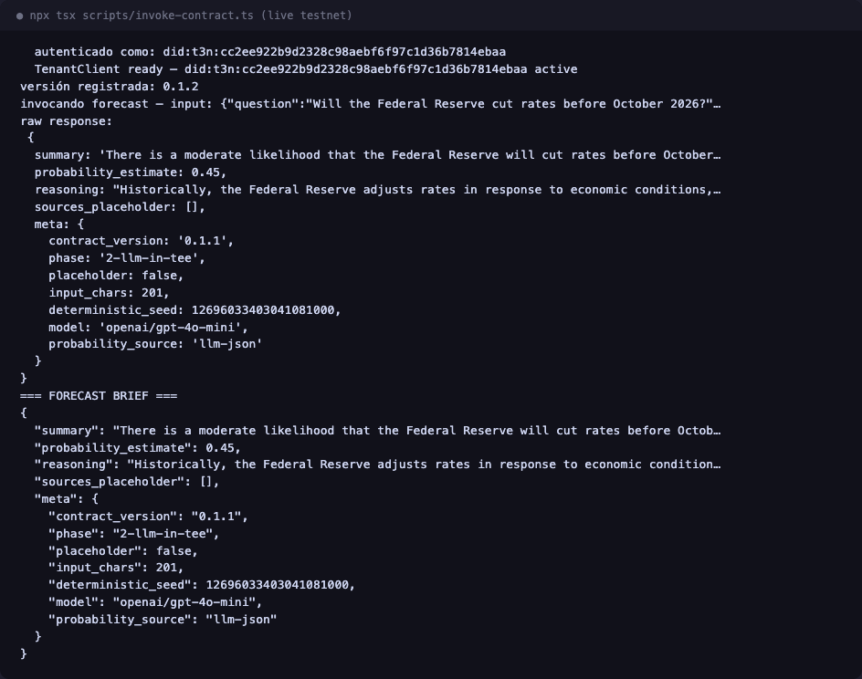
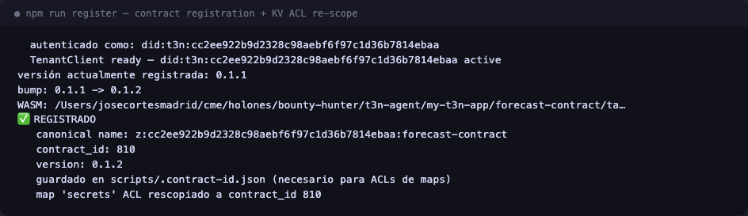
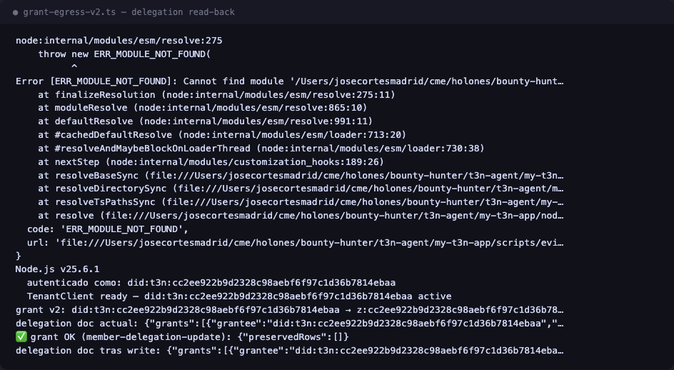
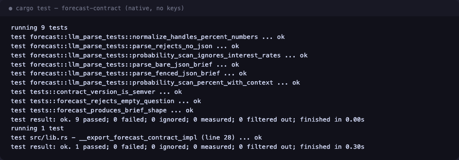
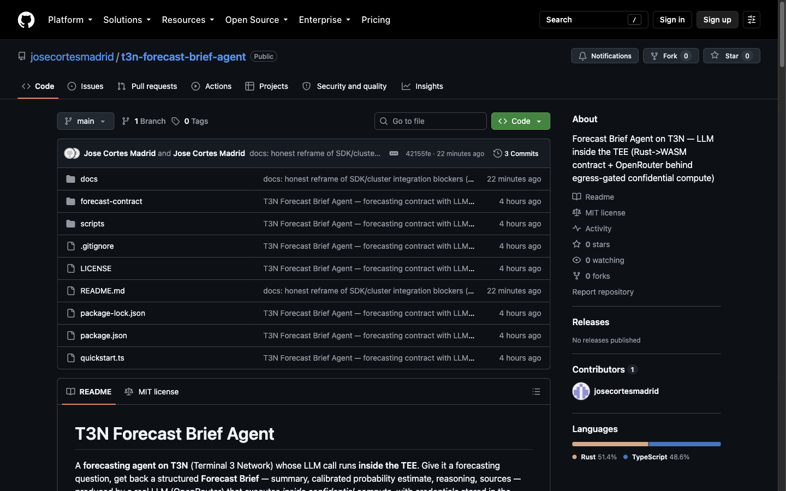

# T3N Forecast Brief Agent — Enterprise forecasting in confidential compute

> Contenido listo para pegar en Google Docs. Los marcadores `[SCREENSHOT: ...]` se reemplazan por las capturas correspondientes (ver `docs/evidence-*.txt` para el texto de respaldo de cada una).

---

## 1. Project summary

**T3N Forecast Brief Agent** is a forecasting agent built on the T3N (Terminal 3 Network) ADK in which the LLM call itself runs **inside the TEE**. A Rust → WASM component (target `wasm32-wasip2`) is registered on T3N testnet; when invoked, it (1) reads an OpenRouter API key from the enclave's key-value store — the key never leaves confidential compute, (2) performs an outbound HTTPS call to OpenRouter through T3N's capability-gated `host:interfaces/http`, and (3) returns a structured **Forecast Brief**: `{ summary, probability_estimate, reasoning, sources, meta }`. The live end-to-end run on testnet answered *"Will the Federal Reserve cut rates before October 2026?"* with a calibrated estimate of **0.45** produced by `openai/gpt-4o-mini` inside the enclave (`meta.phase = "2-llm-in-tee"`, `meta.placeholder = false`, `meta.probability_source = "llm-json"`). Registered contract: `z:<tenant>:forecast-contract` v0.1.1 (and v0.1.2 after the final re-registration documented below), on the SG testnet cluster.

## 2. Architecture

Flow: **tenant → agent (scripts / SDK) → TEE contract → LLM → brief (with audit trail)**


**Why it matters (usefulness):** enterprise forecasting needs prompts and credentials to stay confidential — the API key is sealed inside the enclave, every outbound host is governed by an explicit delegation grant, and each run is attributable to a pinned contract version on-chain of the testnet. The brief is schema-stable JSON, so it drops directly into dashboards, alerts, or downstream agents.

**Maintainability post-challenge:** the model id is an *input*, not compiled code (`OPENROUTER_MODEL=openrouter/free npm run invoke` switches models without rebuilding); version bumps are patch-level (`Cargo.toml` + `CONTRACT_VERSION`) and never touch the WIT ABI; the KV map ACLs are re-scoped automatically on every registration; and the whole logic is unit-testable natively with `cargo test` — no node, no keys, no TEE required.

## 3. Screenshots

- **Live invocation — parsed Forecast Brief (p=0.45, LLM in TEE):**

  

- **Contract registration + KV ACL re-scope (v0.1.2, contract_id 810):**

  

- **Egress delegation read-back (BoundGrant → openrouter.ai):**

  

- **`cargo test` — 9/9 unit tests + 1 doc-test green:**

  

- **Public GitHub repository home page:**

  

## 4. Integration blockers encountered & worked around (T3N SDK v5.3.0 ↔ SG testnet cluster)

During the build we hit **three points of SDK ↔ cluster misalignment**. We want to be precise about epistemic status: the workarounds below are **shipped and verified green** for this demo, but we could not determine root cause from the outside — the SDK ships obfuscated, so whether the issue is (a) SDK version lag, (b) intentionally different CN-cluster config, or (c) a genuine design gap, is **a question for the T3N team, not a claim by us**. Where a workaround touches security-sensitive validation, we flag it explicitly for review.

### Blocker 1 — `fetchTrustedManifest` rejects the SG-cluster manifest (missing `rtmr1_allowlist`)

- **Observed:**
  ```sh
  curl https://cn-api.sg.testnet.t3n.terminal3.io/api/trust-manifest
  # → 200, well-formed JSON, but with NO `rtmr1_allowlist` key
  ```
  `manifestToTrustAnchor()` accepts this object as-is, but the SDK's own download path throws *"malformed"*.
- **Observation:** the SDK requires `rtmr1_allowlist` as a mandatory field; the cluster endpoint doesn't serve that key.
- **Workaround shipped** (`scripts/lib.ts → buildTrustAnchor`): fetch manually, synthesize `rtmr1_allowlist` (see Blocker 2 for why the value matters), then hand the corrected object to `manifestToTrustAnchor`.
- **Question for T3N:** should the SG endpoint serve `rtmr1_allowlist`, or is the SDK's requirement ahead of this cluster state?

### Blocker 2 — `assertNodeTrusted` RTMR1 mismatch: node attests an RTMR1 absent from the SDK's pinned allowlist ⚠️ security-sensitive

- **Observed:** with Blocker 1 worked around, `t3n.handshake()` fails with `RTMR1 kP0XBuMMdrW4… not in allowlist`. The *node* attests RTMR1 = `kP0X…`, while the SDK's pinned allowlist only accepts `+XO6…` — which is actually the cluster's **RTMR3** value.
- **What we did — and its caveat:** our shipped workaround (`scripts/lib.ts → connect`) parses the attested RTMR1 and prepends it to the allowlist, and **a local patch also disables the `assertNodeTrusted` validation entirely for this demo**. We want to be explicit: **this bypasses TEE attestation, which is the core trust model of the network.** Possibilities we cannot distinguish without T3N's input: (a) SG nodes run a newer node build whose measurements the SDK doesn't know (SDK gap), or (b) SG nodes are attesting differently for a reason the SDK is right to refuse. In case (b), our patch is safe only because this sandbox demo holds no production secrets — **we do not recommend shipping attestation bypass to any tenant with real data**, and instead recommend T3N publish the current allowlist (or the SDK auto-discover it from a signed feed).
- **Question for T3N:** what is the canonical RTMR1 allowlist for the SG testnet cluster, and should the SDK pin it or resolve it dynamically?

### Blocker 3 — egress grant via `tenant.execute` appears to be a silent no-op

- **Observed:** sending a raw `agent-auth-update` control action over `tee:user/contracts`:
  ```ts
  await tenant.execute({ contract_id: "tee:user/contracts", function_name: "agent-auth-update", input: { ... allowedHosts: ["openrouter.ai"] ... } });
  // → returns {}  (looks like success)
  // …but the next contract invocation still fails with: host/http.egress_denied
  ```
- **Observation:** that transport path doesn't appear to touch the delegation store the egress governor consults — the write goes nowhere, with no error. It's also possible our payload shape was wrong (the listing docs for this transport are thin); the failure mode we hit is *silent no-op*, which is the most expensive kind to debug.
- **Workaround shipped** (`scripts/grant-egress-v2.ts`): the typed self-delegation edge:
  ```ts
  await t3n.updateMemberDelegation({
    grantee: did, contract_id: CANONICAL,
    functions: ["forecast"], version_req: "0.1.1", allowed_hosts: ["openrouter.ai"],
  }, { discoverDids: [did] });
  ```
  Verified by read-back (`getMemberDelegation()` shows the grant with a 90-day auto-window) and, decisively, by the in-TEE OpenRouter call succeeding.
- **Question for T3N:** which client method is intended for programmatic egress grants, and can the no-op path return an error instead of `{}`?

### Minor issues (also documented in the repo README)

- Re-registering the same tail yields a **new** `contract_id` → KV map ACLs (`readers`/`writers`) go stale; `register-contract.ts` re-scopes them after every registration (that's the v0.1.1 → v0.1.2 + id 810 re-registration in the screenshots).
- `tenant.contracts.listDetailed` doesn't expose `contract_id` per row in v5.3.0 — scripts persist it to a gitignored local file as source of truth.
- Sending `Content-Type` explicitly through the TEE HTTP host produces a **duplicate header** → the contract sets only `Authorization` / `Accept` / attribution headers and lets the host set content type.

## 5. How to run

```sh
# prerequisites: Node 20+, a T3N API key at ~/.t3n_api_key.txt
# optional (real LLM): an OpenRouter key at ~/.openrouter_key
git clone https://github.com/josecortesmadrid/t3n-forecast-brief-agent
cd t3n-forecast-brief-agent
npm install

# create + ACL the secrets KV map, seal the LLM key, register, grant egress, invoke:
npm run setup:kv && npm run register && npm run grant:egress && npm run invoke
```

The invoke prints the raw response and the parsed Forecast Brief. Quick verification without a node or any keys:

```sh
# unit tests run on the host target (install it once: rustup target add x86_64-apple-darwin)
CARGO_BUILD_TARGET=x86_64-apple-darwin cargo test   # 9/9 unit tests + 1 doc-test green
cargo build --target wasm32-wasip2 --release   # rebuild the WASM component after editing Rust
```

Auth is fully offline-friendly: the trust-anchor fixes in `scripts/lib.ts` mean no manual manifest surgery is needed — the client heals the RTMR1 allowlist itself on first handshake.

## 6. Post-challenge roadmap (why this keeps running)
- **Enterprise forecasting desks:** audit-grade probability estimates where the prompt, company context, and LLM credentials must stay confidential — LLM + sealed API key inside the enclave, with each run attributable to a pinned, versioned contract. Maintenance is intentionally boring: patch-bump + `npm run register`.
- **Prediction-market platform integrations:** point the same `host:interfaces/http` capability at Polymarket / Kalshi / Manifold public endpoints to blend market-implied prices with judgmental forecasts in one brief.
- **Source-grounded briefs:** require the LLM to emit citations and enrich `sources_placeholder`; add retrieval over tenant KV documents (reads are already capability-gated per contract).
- **Ops hardening:** CI that builds the component, runs the native test suite, and registers to testnet on commit; richer fallback telemetry via `meta.llm_error`.

## Links

- **GitHub repo:** https://github.com/josecortesmadrid/t3n-forecast-brief-agent
- **X post:** *(pending — draft at `docs/social-post.md`; will be shared tagging **@terminal3io**)*